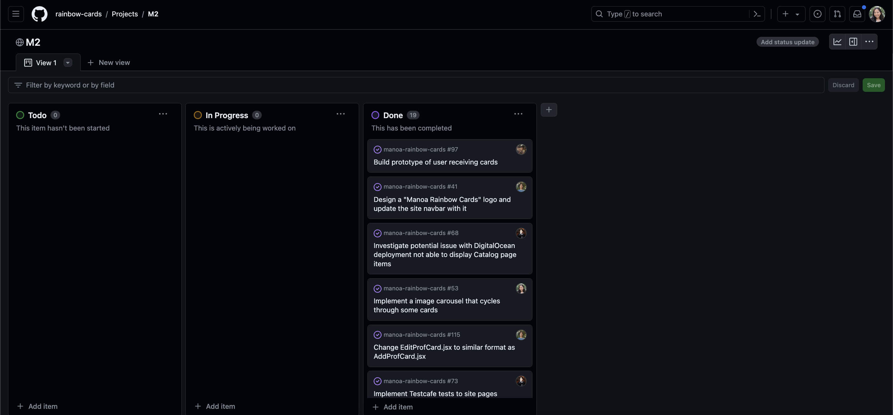

With my time in ICS 314 coming to an end, I want to reflect on all of the key components that makes up Software Engineering. I've learned that its not just about typing code and running it to see if it correctly executes or not. There's more to it than just that. We've learned about Open Source Software Development, Configuration Management, Functional Programming, Development Environments, Coding Standards, User Interface Frameworks, Agile Project Management, Design Patterns, and Ethics in Software Engineering. I will say this was the most time consuming class I have ever taken but boy this is the most I've ever learned in a class. I will take everything I have learned and apply it to my future as I move forth in my career in tech. With that being said, let's dig deep into a few of my most valuable lessons learned. 

## Coding Standards

Coding standards are universal guidelines for programming code within a software project. They ensure organization and readability across the project by establishing rules for written code such as naming conventions, organization, indentation, structured programming, errors and handling, and etc. For example, having meaningful and understandable variables name helps anyone to understand the reason for using it. Proper indentation is important to increase the readability of the code. programmers use white spaces, for example, each nested block. These rules are set so code is understandable and there is no room for misunderstanding among developers, reduce errors and the need for debugging, and promotes sound programming practices and increases efficiency of the programmers
As my ICS 212 professor said, "there is no point of writing code if your teammates can't understand or read it. Time is wasted just trying to figure out what in the world you wrote." Essentially, your code and hard work means nothing if no one can read or understand it. 

## Agile Project Management 
The second valuable lesson I want to talk about is  Issue Driven Project Management (IDPM) in Agile Project Management. IDPM is a management process created to help the organizatino of project development of a group of people. This semester, I was very fortunate to work with a great group of people for my final project: Manoa Rainbow Cards. IDPM breaks up a project into several milestones, ours had 3 milestones, that was spread out over the course of a month. For each milestone, the workload between each member of the group was divided evenly. The idea of the issue driven project management was that each member would work on 1 issue at a time and once completed, it would be checked and sent to the "completed" box. Each issue has a description of the task and keeps everyone on track to completing the project on time. To stay accountable, it keeps track of the amount of issues one has completed. 
 
