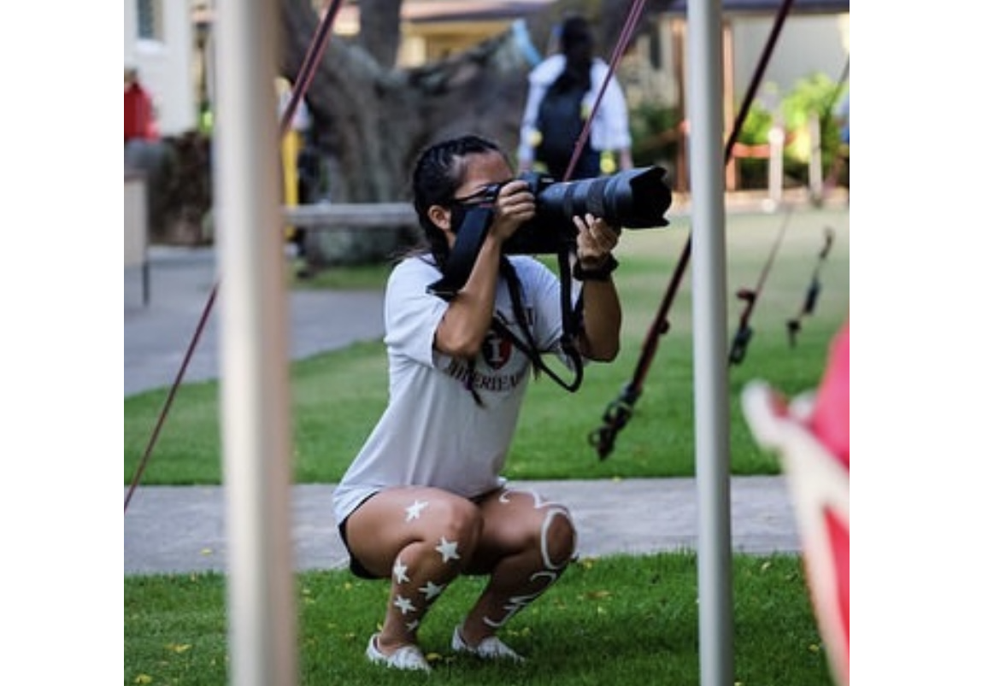

  
  
 
  

My passion for photography and videography started in highschool that has continued throughout my journey. My passion for capturing the essence of significant moments truly makes my heart happy. Using technical softwares such as Adobe Bridge, Photoshop iMovie, this process involves not just capturing images and videos but transforming them into compelling visual stories. The meticulous editing in Photoshop allows me to enhance every detail, from color grading to retouching, ensuring that each frame resonates with the emotion of this particular moment. This allows me to capture special events like first days of school, graduations, luaus, sporting events, and other pivotal occasions. The culmination of these efforts results in the creation of 45-second video clips, thoughtfully compiled to encapsulate the spirit of each event. Uploading these videos to the school's social media becomes a moment of shared celebration and showcasing school life. This culmination of creativity, technical skill, and storytelling forms one of my dedication to visually documenting and sharing the most memorable aspects of my community's lives.
  During my sophomore and junior years, I was an active member of the yearbook staff, where I contributed by taking photos, creating graphic designs, and writing stories. In my senior year, I assumed the role of photo editor, overseeing tasks such as photo editing, photography, video creation, and providing guidance to the staff on photography techniques.
  Skills acquired during my time on the yearbook staff include effective time management, proficiency in using iMovie for video editing, and the ability to edit and crop music. Additionally, I gained valuable knowledge about photography, cameras, and advanced skills in video editing.

To view some of my projects:  
[project 1](https://www.instagram.com/p/CPSKp9GgXrG/) 
[project 2](https://www.instagram.com/p/CGJzmjol5t-/) 
[project 3](https://www.instagram.com/p/CBJYButlnTg/) 
[project 4](https://www.instagram.com/p/B93XlEVF1EA/) 

*Certain pictures were captured with the assistance of additional photographers.

