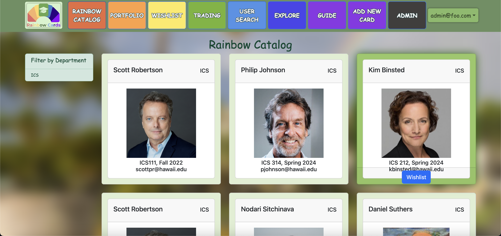
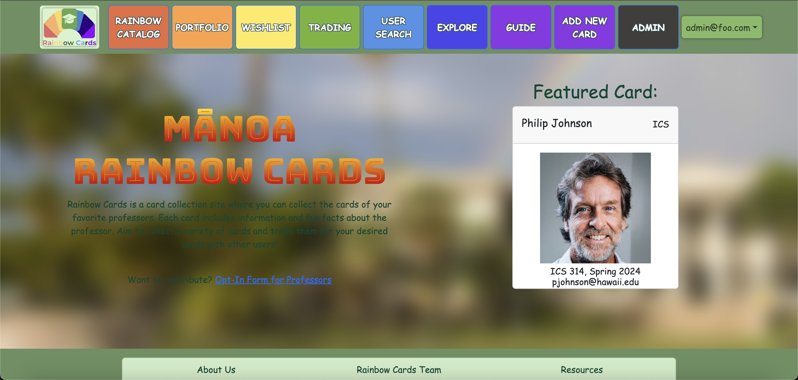

Our project: 
Manoa Rainbow Cards is a Trading Card Game is a TCG application thataims to increase familiarity and engagement between the students and professors of the UH Manoa campus. Each professor card comes with various contact information, projects/achievements and fun facts about them, which may also be traded between users of the app. This further fosters a sense of community on campus, and helps students connect to their mentors better in a fun and engaging way! Beyond trading, card availability is limited based on factors like the number of people who registered for the course, card waves being limited to each academic semester, and a random chance to obtain a particular card, therefore encouraging interaction and trade between users to get professor cards they want. By students of the UH campus interacting with each other, Manoa Rainbow Cards hopes to contribute toward bridging the gap between student and faculty member and unify the family of the UH system that much more.

Link to our Homepage: 
https://manoa-rainbow-cards.xyz/home

Direct link to website: 
https://rainbow-cards.github.io/
